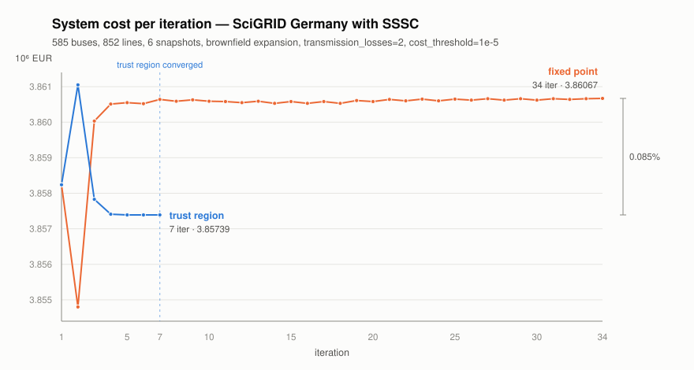

# Iterative transmission expansion with impedance feedback

Reference for `pypsa.optimization.abstract.optimize_transmission_expansion_iteratively`.
It specifies the two outer schemes (`scheme="fixed_point"` and
`scheme="slp"`), the two step controls that bound their steps
(`trust_region` and `proximal`) and the convergence criterion, in the notation
of the SSSC capacity expansion model. Equation numbers in parentheses refer to that
paper. All quantities of the voltage law are per unit; the superscript $\mathrm{pu}$
is dropped throughout.

---

## 1. What is nonlinear

The capacity expansion problem is a linear program except for the Kirchhoff
voltage law (KVL). Expanding an AC branch lowers its impedance (9),

$$\hat{x}_\ell(F_\ell) \;=\; \hat{x}^0_\ell \frac{F^0_\ell}{F_\ell},$$

and the series compensation of an SSSC enters the same equation divided by the
branch capacity. Per independent cycle $c$ and snapshot $t$ the exact law (7) is

$$\sum_{\ell \in \mathcal{L}} C_{\ell,c}\, g_{\ell,t} = 0,
\qquad
g_{\ell,t} \;=\; \hat{x}_\ell(F_\ell)\, f_{\ell,t} \;-\; \frac{\tilde{q}_{\mathrm{SSSC},\ell,t}}{F_\ell}.$$

Both terms of the branch term $g_{\ell,t}$ are proportional to $1/F_\ell$, so
$g_{\ell,t}$ is a nonlinear (bilinear-rational) function of the decision
variables, and both are covered by a single capacity sensitivity in section 5.1.

The ohmic losses are **not** part of this nonlinearity. Unlike Algorithm 1 of
the paper, which recomputes the envelope coefficients $\alpha_{\ell,m}$,
$\beta_{\ell,m}$ of (1r)/(10c) from $\mathbf{R}^{n,\mathrm{fix}}$ in every
iteration, the implementation writes the envelope exactly in $F_\ell$: with
$r_\ell = r^0_\ell F^0_\ell / F_\ell$ and the flow range $\pm F_\ell$, the
segment slopes are capacity independent and the offsets are linear in $F_\ell$,
so the offset is carried as a term in the capacity variable. Lines 3–4 of
Algorithm 1 are therefore needed for $\hat{\mathbf{X}}$ only, and the outer
iteration exists for the voltage law alone.

---

## 2. Notation

### Sets and indices

| Symbol | Meaning |
| --- | --- |
| $\ell \in \mathcal{L}$ | passive branches (`Line`, `LineX`, `Transformer`) |
| $\mathcal{L}^{\mathrm{ext}} \subseteq \mathcal{L}$ | branches with extendable capacity |
| $\mathcal{L}^{\mathrm{scale}} \subseteq \mathcal{L}^{\mathrm{ext}}$ | branches whose impedance scales with the capacity: extendable AC-carrier branches without a standard type, plus extendable branches with a type (scaled through `num_parallel`) |
| $c \in \mathcal{C}$ | independent cycles of the passive network, one basis per sub-network |
| $t \in T$ | snapshots |
| $n$ | outer iteration counter |

### Data

| Symbol | Code | Meaning |
| --- | --- | --- |
| $C_{\ell,c} \in \{-1,0,1\}$ | `sub.C` | orientation of branch $\ell$ in cycle $c$ (3) |
| $F^0_\ell$ | `s_nom` at entry | capacity the given impedance refers to |
| $\hat{x}^0_\ell$ | `x_pu_eff` at entry | natural reactance at $F^0_\ell$; in DC sub-networks the resistance $r^0_\ell$ takes its place throughout |
| $c_\ell$ | `capital_cost` | annualised capacity cost of branch $\ell$ (1a) |
| $F^{\min}_\ell, F^{\max}_\ell$ | `s_nom_min`, `s_nom_max` | capacity bounds as given by the user (1f) |
| $\varepsilon$ | `cost_threshold` | convergence tolerance, here on the system cost rather than on the capacities as in Algorithm 1 |
| $\varepsilon_{\mathrm{tgt}}, \varepsilon_{\max}$ | `trust_region_tolerances` | linearisation error that is good enough / too large |
| $\rho_{\min}, \rho_{\max}$ | `trust_region_bounds` | admissible trust region radii |
| $\sigma, \gamma$ | `trust_region_factors` | shrink and expand factor of the radius |
| $\tau$ | `sensitivity_tolerance` | loading below which a branch sensitivity is dropped |

### Iteration quantities

| Symbol | Code | Meaning |
| --- | --- | --- |
| $F^{n,\mathrm{fix}}_\ell$ | `current_def`, `_s_nom_def` | **linearisation point**: the capacity the impedances of iteration $n$ are evaluated at |
| $\hat{x}^{n,\mathrm{fix}}_\ell = \hat{x}^0_\ell F^0_\ell / F^{n,\mathrm{fix}}_\ell$ | `x_pu_eff` | natural reactance used in iteration $n$ |
| $F^{n,*}_\ell$ | `s_nom_opt` | capacity returned by the LP of iteration $n$ |
| $f^{n,*}_{\ell,t}$ | `p0` | branch flow returned by the LP |
| $\tilde{q}^{\,n,*}_{\mathrm{SSSC},\ell,t}$ | `q_sssc` | SSSC control variable returned by the LP |
| $g^{n,*}_{\ell,t}$ | `cycle_terms` | branch term of the new iterate, evaluated at **its own** capacities $F^{n,*}$ |
| $g^{n,\mathrm{fix}}_{\ell,t}$ | `_kvl_capacity_sensitivity` | branch term at the linearisation point, $= g^{n-1,*}_{\ell,t}$, truncated by $\tau$ |
| $u_\ell$ | `{Line,LineX}-s_nom_relative` | relative deviation of the capacity from the linearisation point |
| $V^n, \hat{V}^n$ | `violation`, `violation_rel` | absolute and relative residual of the exact KVL |
| $\mathrm{step}^n$ | `step` | relative capacity change ("msq"), **diagnostic only** |
| $obj^n$ | `cost` | system cost of the iterate |
| $\rho^n$ | `radius` | trust region radius |
| $\Delta^{n,-}_\ell, \Delta^{n,+}_\ell$ | — | trust region half widths below / above the linearisation point |

---

## 3. The inner problem

Let $\mathrm{LP}(F^{\mathrm{fix}}, g^{\mathrm{fix}}, \Delta)$ be problem (10) in
which

* the branch impedances are those of $F^{\mathrm{fix}}$,
* the KVL constraint is the one of section 5.2 with the sensitivities carried by
  $g^{\mathrm{fix}}$ through the relative capacity deviations $u$,
* the capacities are restricted to the box of half widths $\Delta^\pm$.

Setting $g^{\mathrm{fix}} = 0$ and $\Delta = \infty$ recovers (10d) itself, the
LP of the plain fixed-point scheme — the deviation variables are then not
created at all.

A capacity vector is a **solution of the nonlinear problem** if it reproduces
itself, $F^{n,*} = F^{n,\mathrm{fix}}$, in which case the exact KVL holds,
because the frozen impedances then are the impedances of the reported
capacities.

---

## 4. Scheme A — fixed point (`scheme="fixed_point"`)

The impedances are frozen at the previous iterate and the KVL stays zeroth
order in the capacity, which is (10d):

$$\sum_{\ell} C_{\ell,c}\left( \hat{x}^{n,\mathrm{fix}}_\ell f_{\ell,t} - \frac{\tilde{q}_{\mathrm{SSSC},\ell,t}}{F^{n,\mathrm{fix}}_\ell} \right) = 0,
\qquad F^{n+1,\mathrm{fix}} = F^{n,*}.$$

This is Algorithm 1 of the paper. It is kept for reference and comparison; the
default is scheme B.

---

## 5. Scheme B — linearised KVL (`scheme="slp"`, default)

### 5.1 First-order model of the branch term

With $g_{\ell,t} = \left(\hat{x}^0_\ell F^0_\ell f_{\ell,t} - \tilde{q}_{\mathrm{SSSC},\ell,t}\right) / F_\ell$,

$$\left.\frac{\partial g_{\ell,t}}{\partial F_\ell}\right|_{F^{n,\mathrm{fix}}}
= -\frac{\hat{x}^0_\ell F^0_\ell f^{n-1,*}_{\ell,t} - \tilde{q}^{\,n-1,*}_{\mathrm{SSSC},\ell,t}}{\left(F^{n,\mathrm{fix}}_\ell\right)^2}
= -\frac{g^{n,\mathrm{fix}}_{\ell,t}}{F^{n,\mathrm{fix}}_\ell}.$$

Because the natural reactance term and the SSSC term are **both** homogeneous of
degree $-1$ in $F_\ell$, this single sensitivity is the derivative of the whole
term; no separate treatment of the compensation is needed. It is the branch term
of the linearisation point divided by its capacity, so no extra evaluation is
needed either. Expanding to first order in
$(F_\ell, f_{\ell,t}, \tilde{q}_{\mathrm{SSSC},\ell,t})$ around
$(F^{n,\mathrm{fix}}_\ell, f^{n-1,*}_{\ell,t}, \tilde{q}^{\,n-1,*}_{\mathrm{SSSC},\ell,t})$,
the constant $g^{n,\mathrm{fix}}_{\ell,t}$ and the expansion of the two terms
that are linear at fixed capacity collapse, and what is left is

$$\boxed{\;g_{\ell,t} \;\approx\; \hat{x}^{n,\mathrm{fix}}_\ell f_{\ell,t} - \frac{\tilde{q}_{\mathrm{SSSC},\ell,t}}{F^{n,\mathrm{fix}}_\ell} - \frac{g^{n,\mathrm{fix}}_{\ell,t}}{F^{n,\mathrm{fix}}_\ell}\left(F_\ell - F^{n,\mathrm{fix}}_\ell\right)\;}$$

The first two terms are those of (10d); the third is the impedance feedback the
fixed-point scheme leaves to the outer iteration.

The constant of the expansion is thus not dropped but absorbed. Writing the
model purely in the increments
$(f - f^{n-1,*},\, \tilde{q} - \tilde{q}^{\,n-1,*},\, F - F^{n,\mathrm{fix}})$
instead would leave out $\sum_\ell C_{\ell,c}\, g^{n,\mathrm{fix}}_{\ell,t}$,
the exact KVL residual of the linearisation point, which is the quantity the
trust region monitors as $V^n$ and is not zero — the previous LP enforced the
voltage law at $F^{n-1,\mathrm{fix}}$, not at $F^{n,\mathrm{fix}} = F^{n-1,*}$.
Such a model would admit the previous iterate as a feasible point of every cycle
and would stop enforcing the voltage law at the fixed point.

Two properties follow, and both are used by the algorithm:

1. The model is **exact for $F_\ell = F^{n,\mathrm{fix}}_\ell$** and any
   $(f, \tilde{q})$: the correction vanishes and the constraint collapses onto
   (10d). A converged iterate therefore satisfies the exact KVL.
2. The error is exactly

   $$g^{\mathrm{exact}}_{\ell,t} - g^{\mathrm{lin}}_{\ell,t} = u_\ell\left(g^{n,\mathrm{fix}}_{\ell,t} - g^{\mathrm{exact}}_{\ell,t}\right),
   \qquad u_\ell = \frac{F_\ell}{F^{n,\mathrm{fix}}_\ell} - 1,$$

   the product of the relative capacity change and the change of the term. It is
   second order, and it is what the trust region has to keep small. At frozen
   flows it specialises to

   $$g^{n,\mathrm{fix}}_{\ell,t}\,\frac{u_\ell^2}{1 + u_\ell},$$

   which is the form the shape of the trust region is derived from in
   section 6.1.

### 5.2 The constraint as implemented

The correction is **not** written on the capacity itself but on the
dimensionless relative deviation

$$u_\ell \;=\; \frac{F_\ell}{F^{n,\mathrm{fix}}_\ell} - 1,
\qquad\text{defined by}\qquad
\frac{1}{F^{n,\mathrm{fix}}_\ell} F_\ell - u_\ell \;=\; 1
\quad \forall\, \ell \in \mathcal{L}^{\mathrm{ext}},$$

one extra column and one extra row per extendable branch of the components that
carry a sensitivity. With $g^{n,\mathrm{fix}}_{\ell,t} = 0$ for
$\ell \notin \mathcal{L}^{\mathrm{scale}}$, the constraint that replaces (10d)
per cycle $c$ and snapshot $t$ is

$$\sum_{\ell} C_{\ell,c}\left( \hat{x}^{n,\mathrm{fix}}_\ell f_{\ell,t} - \frac{\tilde{q}_{\mathrm{SSSC},\ell,t}}{F^{n,\mathrm{fix}}_\ell} - g^{n,\mathrm{fix}}_{\ell,t}\, u_\ell \right)
\;=\; 0 .$$

The coefficient of $u_\ell$ is the branch term of the linearisation point
itself: the factor $F^{n,\mathrm{fix}}_\ell$ of the deviation cancels the one in
the denominator of the sensitivity. The whole row is scaled by $10^4$ as in the
original formulation. That coefficient is time dependent, so those rows carry
two-dimensional coefficients; the right-hand side, however, is a plain zero.

The first iteration has no linearisation point and is therefore a plain
fixed-point step, with neither the deviation variables nor the box.

### 5.2.1 Why the deviation and not the capacity

Writing the correction on $F_\ell$ directly is algebraically identical but
numerically unusable, for two reasons.

**The right-hand side is a cancelling sum.** It would be
$-\sum_\ell C_{\ell,c}\, g^{n,\mathrm{fix}}_{\ell,t}$, i.e. exactly the KVL
residual of the linearisation point discussed in section 5.1. On the cycles and
snapshots the previous iterate already satisfies, that is a sum of terms of
order $10^{-3}$–$10^{0}$ cancelling down to round-off, and the solver is handed
right-hand sides of order $10^{-10}$ that drift upward as the linearisation
moves.

**The coefficients collapse.** The coefficient on $F_\ell$ is
$10^4 C_{\ell,c}\, g^{n,\mathrm{fix}}_{\ell,t} / F^{n,\mathrm{fix}}_\ell$, which
for a branch without compensation is the flow coefficient of the same branch in
the same row multiplied by its loading
$f^{n-1,*}_{\ell,t}/F^{n,\mathrm{fix}}_\ell \in [0,1]$ and divided by nothing
that brings it back. A branch that is idle at a snapshot therefore contributes a
coefficient several orders of magnitude below every other entry of its row. This
is a spread *within* the row, so row scaling cannot remove it, and column
scaling cannot either: the same column carries the capacity cost of (1a), the
thermal limits (1s) and the volume limit (1h), where the MW scale is the correct
one.

The substitution $F_\ell = F^{n,\mathrm{fix}}_\ell (1 + u_\ell)$ is precisely
the missing column scaling, applied to a column that is used by the voltage law
alone. It multiplies every sensitivity coefficient by $F^{n,\mathrm{fix}}_\ell$,
which puts it on the scale of the flow coefficients of its own row, and it
absorbs the constant of the linearisation, which leaves the right-hand side at
zero. Since $F_\ell \ge 0$, the bound $u_\ell \ge -1$ is exact and needs no
assumption on the step size; the box of section 6.1 stays on $F_\ell$.

### 5.2.2 Dropping negligible sensitivities

The rescaling fixes the *scale* of the sensitivity coefficients but not their
*spread*: the coefficient of $u_\ell$ is
$10^4 C_{\ell,c}\, g^{n,\mathrm{fix}}_{\ell,t}$ and still vanishes with the flow
of the branch. The flows come from a barrier solve without crossover, so an idle
branch is never returned at exactly zero but at $10^{-9}$ MW or so, which is
enough to keep the entry in the matrix.

Sensitivities that are negligible against the voltage drop their **own** branch
causes at its rated capacity are therefore set to zero before the model is
built:

$$\left| g^{n,\mathrm{fix}}_{\ell,t} \right| \;\le\; \tau\, \hat{x}^{n,\mathrm{fix}}_\ell F^{n,\mathrm{fix}}_\ell
\quad\Longrightarrow\quad g^{n,\mathrm{fix}}_{\ell,t} \leftarrow 0 ,$$

with $\tau =$ `sensitivity_tolerance`, default $10^{-6}$. On an uncompensated
branch the criterion is a loading threshold: a branch loaded below $\tau$ of its
rating at a snapshot has no influence on the voltage law of that snapshot. The
surviving coefficients are bounded below by
$\tau \cdot 10^4\, \hat{x}^{n,\mathrm{fix}}_\ell F^{n,\mathrm{fix}}_\ell$, i.e.
by $\tau$ times a quantity the impedance scaling (9) leaves invariant under the
iteration, so the range of the constraint matrix no longer degrades from one
iteration to the next. The dropped terms perturb their row by less than $\tau$
of its rated voltage drop — two orders of magnitude below
$\varepsilon_{\mathrm{tgt}}$, the linearisation error the iteration considers
good. `sensitivity_tolerance=0` keeps every sensitivity.

The linearisation error of section 6.1 is measured on the untruncated branch
terms $g^{n,*}$, so the truncation cannot hide itself from the acceptance test.

### 5.3 Fallback

The linearised LP can be infeasible where the frozen impedances require more
capacity than the box admits. Shrinking would make this worse, so the next
iteration is taken as an unrestricted fixed-point step, which is always
feasible, while the radius is already shrunk for the iteration after it. The
same fallback is used if a solve reports success but returns capacities below
their own lower bounds, which is how a numerically failed solve shows up — such
a point must not become a linearisation point.

### 5.4 What the loop returns

Intermediate iterations read back only the variable groups the outer loop needs
— the branch capacities, the KVL flows `{Line,LineX}-s` and, where present,
`LineX-q_sssc`, plus the nominal-capacity columns and objective scalars if
`track_iterations=True` — and neither duals nor derived time series.

* **On convergence** the converged iterate's own LP *is* the result. Its
  already-solved model is completed in place — on the Gurobi fast path from the
  same solved model, without a second call to the solver — and the full primal
  solution, the duals and the derived network time series are assigned from it.
  There is no re-solve at the converged point, unlike line 7 of Algorithm 1.
* **Without convergence** (`max_iterations` exhausted, or the radius bottomed
  out on a rejected step) the last attempted solve was discarded, so one further
  solve is run at the last accepted capacities $F^{\mathrm{fix}}$, in the plain
  formulation (10d) — no sensitivities, no box — to obtain a fully populated
  network. If that solve fails, the status of the last successful loop solve is
  reported.

In both cases the trust region bounds and the sensitivity attached to the
network are removed afterwards, also when the loop is left through an exception.

---

## 6. Step control

The linear model of section 5.1 is exact at its own point and says nothing about
how far from it it may be trusted, so nothing in the inner problem keeps the
capacities near the linearisation point. Two controls bound the step. They are
independent of each other and of the scheme — the fixed point takes an equally
unbounded step and is helped by the same controls — and both are adapted during
the iteration rather than set by the user.

They bound the step in different ways, and the difference is what makes them
complementary:

* the **trust region** is a hard bound: the capacities themselves are
  restricted, so the inner problem cannot return a longer step whatever its
  objective would gain from one. What it cannot do is choose *within* the box, so
  on a degenerate problem it hands the solver a face of equal-cost plans and lets
  it pick any corner of it.
* the **proximal term** is a soft bound. It prices the step instead of forbidding
  it, so no bound on the step follows from it alone, but it breaks exactly that
  degeneracy: of two plans of equal system cost it selects the one closer to the
  previous iterate, which is the one whose voltage law the linearisation still
  describes.

Either control is enough to *reject* a step and re-solve at the same
linearisation point, since the rejection is decided by the residual the step
leaves (section 6.3) and not by which control is active. What the two do
differently is how the re-solve is made to take a shorter step: on a smaller box,
or under a heavier penalty.

### 6.1 Trust region (`trust_region=True`)

The radius is relative to the capacity of the linearisation point and floored by
the initial capacity, so it cannot collapse for a branch shrinking towards zero:

$$\Delta^{n,-}_\ell = \frac{\rho^n}{1 + \rho^n}\max\left(F^{n,\mathrm{fix}}_\ell,\, F^0_\ell\right),
\qquad
\Delta^{n,+}_\ell = \rho^n \max\left(F^{n,\mathrm{fix}}_\ell,\, F^0_\ell\right),$$

$$\max\left(F^{\min}_\ell,\, F^{n,\mathrm{fix}}_\ell - \Delta^{n,-}_\ell\right)
\;\le\; F_\ell \;\le\;
\min\left(F^{\max}_\ell,\, F^{n,\mathrm{fix}}_\ell + \Delta^{n,+}_\ell\right).$$

**Why the region is not symmetric.** By property 2 of section 5.1 the
linearisation error at frozen flows is
$g^{n,\mathrm{fix}}_{\ell,t}\,u_\ell^2/(1+u_\ell)$, which is even in neither
direction: it stays second order while the capacity grows but diverges as the
capacity collapses. A symmetric box would therefore tolerate a much larger error
on the side where the capacity shrinks — three times as much at $\rho = 0.5$,
and an unbounded amount from $\rho = 1$ on, where the symmetric region reaches a
vanishing capacity. The half widths above equalise it: where the floor is not
active the box is the geometrically symmetric interval

$$\frac{F^{n,\mathrm{fix}}_\ell}{1 + \rho^n} \;\le\; F_\ell \;\le\; F^{n,\mathrm{fix}}_\ell \left(1 + \rho^n\right),$$

which is the natural symmetry of a term proportional to $1/F_\ell$, and both
ends leave the same error
$g^{n,\mathrm{fix}}_{\ell,t}\,(\rho^n)^2/(1+\rho^n)$.

**Linearisation error.** The linear model predicts a vanishing residual, so
whatever residual the new iterate leaves is the model error. It is evaluated at
the capacities of the new iterate — i.e. the impedances are first set to
$F^{n,*}$ — and normalised by the voltage drop the branches of the cycle cause
at their rated capacity. That scale is stable under the iteration: for every
branch whose impedance scales with the capacity it is exactly invariant, since
$\hat{x}_\ell F_\ell = \hat{x}^0_\ell F^0_\ell$ by (9), and for the remaining
ones both factors are fixed by the input data:

$$V^n = \sum_{c,\,t}\left| \sum_\ell C_{\ell,c}\, g^{n,*}_{\ell,t} \right|,
\qquad
\hat{V}^n = \frac{V^n}{|T| \sum_{c} \sum_{\ell} \left|C_{\ell,c}\right| \hat{x}_\ell F_\ell} .$$

**Binding.** The region restricts the step if the branches sitting at its
boundary carry a relevant share of the moved capacity cost. Since the region is
asymmetric, each branch is measured against the half width on the side it
actually moved to, $\Delta^{n,+}_\ell$ if it grew and $\Delta^{n,-}_\ell$ if it
shrank:

$$\text{binding}^n \;=\;
\left[\;
\frac{\sum_{\ell \,:\, \left|F^{n,*}_\ell - F^{n,\mathrm{fix}}_\ell\right| \ge 0.9\,\Delta^{n,\pm}_\ell} c_\ell \left|F^{n,*}_\ell - F^{n,\mathrm{fix}}_\ell\right|}
{\sum_{\ell} c_\ell \left|F^{n,*}_\ell - F^{n,\mathrm{fix}}_\ell\right|} \;\ge\; 0.1
\;\right]$$

The cost weighting matters: in the maximum norm a single small branch swinging
between degenerate optima already fills its own width and would report a
restriction that does not exist.

### 6.2 Proximal term (`proximal="l1"` or `proximal="l2"`)

The inner objective carries an extra penalty on moving a branch capacity away
from the linearisation point,

$$P^n_{\ell_1}(F) = \delta^n \sum_{\ell \in \mathcal{L}^{\mathrm{ext}}} c_\ell \left| F_\ell - F^{n,\mathrm{fix}}_\ell \right|,
\qquad
P^n_{\ell_2}(F) = \delta^n \sum_{\ell \in \mathcal{L}^{\mathrm{ext}}} c_\ell S^n_\ell\, u_\ell^2,$$

in the relative deviation $u_\ell = (F_\ell - F^{n,\mathrm{fix}}_\ell)/S^n_\ell$,
which is the $u_\ell$ of section 5.2 wherever the floor below is inactive, with
$S^n_\ell = \max(F^{n,\mathrm{fix}}_\ell, \underline{S}^n)$ the
anchor floored by $\underline{S}^n = \max(10^{-3}\max_\ell F^{n,\mathrm{fix}}_\ell, 10^{-6})$
so a branch collapsing towards zero cannot make the weight diverge. The weight
$c_\ell$ is the annualised capital cost of the branch (`proximal_metric="capex"`,
the default) or the mean capital cost for every branch
(`proximal_metric="uniform"`, which charges capacity rather than cost).

**The two norms are calibrated on the same scale.** Both charge $\delta^n c_\ell$
for moving branch $\ell$ by its own size, so $\delta$ is dimensionless in both
and the two are directly comparable — the $\ell_2$ coefficient
$\delta c_\ell S_\ell$ multiplied by $u_\ell^2$ at $u_\ell = 1$ is the
$\ell_1$ charge $\delta c_\ell S_\ell$ for the same move. What differs is how the
charge is distributed over smaller moves: $\ell_1$ charges proportionally,
$\ell_2$ quadratically, so relative to $\ell_1$ the quadratic term is cheap for
small moves and expensive for large ones.

**The penalty does not move the converged solution.** Let $J$ be the system cost,
$F^\delta$ minimise $J + P^n$ and $F^\star$ minimise $J$ alone over the same
feasible set. Since $F^\delta$ is optimal for the penalised problem,

$$J(F^\delta) \;\le\; J(F^\delta) + P^n(F^\delta) \;\le\; J(F^\star) + P^n(F^\star),
\qquad\text{hence}\qquad
J(F^\delta) - J(F^\star) \;\le\; P^n(F^\star).$$

The plan the penalty returns costs at most what the penalty charges the
unpenalised plan. That bound is useful because of where it is evaluated: at a
fixed point $F^\star = F^{n,\mathrm{fix}}$, where $P^n$ vanishes. The penalty
biases the *path*, not the limit — it can only shift a solution the iteration has
not converged to. The penalty is also subtracted from the reported system cost,
so the criterion of section 7 sees the true cost throughout.

**Why $\ell_2$ is the safer of the two.** The $\ell_1$ term is modelled with a
non-negative deviation variable per extendable branch and keeps the inner problem
a linear program, which is why it was the first implementation. But its
subdifferential at the anchor is the whole interval $\delta c_\ell[-1, 1]$: a
branch whose reduced cost is smaller in modulus than $\delta c_\ell$ does not
move **at all**. That dead zone is not a mild bias, it is a failure mode — once
$\delta$ is large enough that the zone covers every branch the iterate freezes,
and a frozen iterate reports $\mathrm{step}^n = 0$ and $\hat{V}^n = 0$, i.e. it
*fabricates* the evidence of convergence at a point that is not a solution.
Measured on the test system the cliff sits between $\delta = 10^{-1}$ and
$\delta = 1$: at or below $10^{-1}$ the converged cost is within $10^{-4}$ of the
unpenalised one, at $\delta = 1$ it is 2–11 % above it. Hence
$\delta^{\ell_1}_{\max} = 10^{-1}$, three decades below
$\delta^{\ell_2}_{\max} = 10^{2}$, and hence the warning when $\ell_1$ is the only
active control.

The $\ell_2$ term has no dead zone. Its gradient $2\delta c_\ell u_\ell / S_\ell$
vanishes at the anchor, so the stationarity conditions of the penalised problem
*at the anchor* are exactly those of the unpenalised one, and every branch moves
by an amount that merely shrinks with $\delta$. Over five decades
$\delta \in [10^{-4}, 10]$ the converged cost stays within $5\cdot10^{-5}$ of the
unpenalised one on the test system; the price of a large $\delta$ is iterations,
not accuracy. It needs neither variable nor constraint — the square goes straight
into the objective, whose Hessian is then diagonal and positive semi-definite, so
the inner problem is a convex QP.

**It is a soft trust region.** Stationarity of the penalised inner problem gives
$u_\ell = -r_\ell S_\ell / (2 \delta c_\ell)$ for a branch with reduced cost
$r_\ell$: the relative step the penalty admits is of order $1/\delta$. Raising
$\delta$ is therefore the same move as shrinking $\rho$, which is why one
decision drives both and why they share the factors $\sigma$ and $\gamma$ — with
$\delta$ divided where $\rho$ is multiplied.

### 6.3 Acceptance and adaptation

Both controls are adapted by the same decision, and by the same factors.
Write $\mathrm{tighten}$ for $\rho \leftarrow \max(\sigma\rho, \rho_{\min})$
together with $\delta \leftarrow \min(\delta/\sigma, \delta_{\max})$, and
$\mathrm{relax}$ for $\rho \leftarrow \min(\gamma\rho, \rho_{\max})$ together
with $\delta \leftarrow \max(\delta/\gamma, \delta_{\min})$; whichever control is
switched off is simply left out. Evaluated in this order, and only while at
least one control is active and the iteration has not converged:

| condition | action |
| --- | --- |
| $\hat{V}^n > \varepsilon_{\max}$ | reject the step, $\mathrm{tighten}$ |
| else if $\mathrm{step}^n \ge \mathrm{step}^{n-1}$ | accept, $\mathrm{tighten}$ — no progress, the model is trusted over too wide a range |
| else if $\hat{V}^n \le \varepsilon_{\mathrm{tgt}}$ and (binding or a proximal term is active) | accept, $\mathrm{relax}$ |
| otherwise | accept, both controls unchanged |

The linearisation error $\hat{V}^n$ is only available where a linearisation is
active; where it is not — the first iteration, and every iteration of the fixed
point — the first and third rows read as if the error were acceptable, so the
controls relax rather than stay put.

A binding region is required before the radius is widened because a radius that
does not restrict anything says nothing about the model's range of validity.
The proximal term has no such test: it is always "binding" in the sense that it
always charges for the step it admits, so an acceptable error is enough to lower
its weight.

A step small enough to have converged the cost is always accepted: the
linearisation then reproduces its own point, where the constraint coincides with
the exact one. A rejected step leaves $F^{\mathrm{fix}}$ untouched, so the next
iteration re-solves at the same linearisation point with a smaller radius and a
heavier penalty, whichever of the two is active.

If every active control is exhausted — the radius at $\rho_{\min}$, the weight at
$\delta_{\max}$ — on a step that had to be rejected, the iteration stops and
reports the last accepted iterate.

---

## 7. Convergence criterion

**System cost of an iterate.** Let $z^{n,*}$ be the objective value of the LP.
The cost of the already installed capacity — over every extendable asset, i.e.
the annualised cost coefficient of (1a) times the existing capacity of
generators, storage, AC and DC branches and SSSCs — is subtracted as determined
in the first iteration:

$$obj^n = z^{n,*} - \left(\sum_{g,\,s,\,\ell,\,i} c\,\cdot\,(\text{existing capacity})\right)\Bigg|_{n=1} .$$

Freezing that constant is necessary: for branches with a standard type PyPSA
derives $F_\ell$ from `num_parallel`, so the objective constant that
`n.objective` subtracts drifts with the linearisation capacity and is not
comparable between iterations.

**Criterion.** Over the accepted iterates,

$$\left|obj^{\,n-k} - obj^{\,n-k-1}\right| \Big/ \left|obj^{\,n}\right| \;\le\; \varepsilon
\qquad \text{for } k = 0, \dots, \texttt{cost\_window} - 1 .$$

**Why not the capacity change.** Algorithm 1 stops on
$\mathrm{step}^n = \lVert F^{n,*} - F^{n,\mathrm{fix}} \rVert_2 / \lVert F^0 \rVert_2$,
but that is a step size, not a measure of convergence. It is not invariant under
the exchange of degenerate alternative optima, so it keeps bouncing long after
the solution has settled, and a step can undercut a threshold by accident while
the cost is still drifting. On the SciGRID case both failure modes occur: the
fixed point passes $\mathrm{step}^n < 10^{-2}$ at iteration 10 while its cost
still moves by $4.5\cdot10^{-4}$ per iteration, and the trust region has a
converged cost at iteration 7 with $\mathrm{step}^n \approx 5\cdot10^{-2}$. The
quantity is still reported as `step` because it is a useful diagnostic of
degeneracy.

---

## 8. Measured behaviour

### 8.1 The two schemes on the German system

SciGRID Germany — 585 buses, 852 AC lines, 96 transformers, 6 snapshots — set up
as a brownfield expansion in which renewable generation, storage, the AC lines
and, in the SSSC case, the series compensation are co-optimised. Solved with
Gurobi, `transmission_losses=2`, `cost_threshold=1e-5`.

> These runs predate two changes of scheme B: they used the symmetric trust
> region and `trust_region_tolerances=(1e-3, 1e-1)`. The comparison of the two
> schemes is unaffected in kind, but the iteration counts of the trust region
> should be re-measured with the current defaults.



Both schemes start from the same first LP, whose impedances still belong to the
unexpanded network. From there the fixed point spends 34 iterations creeping
along a band it never leaves, because every impedance update redistributes the
flows again; the trust region anticipates that redistribution, overshoots once
at iteration 2 and has settled from iteration 5 on. The two plans differ by
0.085 % in cost — and by 8 % in the transmission expansion they call for.

| | iterations | system cost | expansion | cost change at stop | capacity change at stop |
| --- | ---: | ---: | ---: | ---: | ---: |
| **without SSSC** — fixed point | 28 | 3.99115e6 | 100.5 GVA | 2.9e-6 | 2.7e-3 |
| **without SSSC** — trust region | **7** | 3.96360e6 | 77.1 GVA | 2.4e-6 | 4.9e-2 |
| **with SSSC** — fixed point | 34 | 3.86067e6 | 71.1 GVA | 9.6e-7 | 1.5e-3 |
| **with SSSC** — trust region | **7** | 3.85739e6 | 65.3 GVA | 1.3e-6 | 3.5e-2 |

Two observations concern the results of the model rather than its numerics.
First, the scheme changes the reported transmission expansion by 8 % (with SSSC)
to 23 % (without) — the same order as the effect of the SSSCs themselves, so the
choice of scheme is not an implementation detail of the solution report. Second,
the capacity change at the stopping point is one to two orders of magnitude
*larger* for the converged trust region than for the fixed point, which is
precisely why it cannot serve as the criterion.

<details>
<summary>Data of the figure</summary>

| iteration | fixed point | trust region |
| ---: | ---: | ---: |
| 1 | 3.85824 | 3.85824 |
| 2 | 3.85480 | 3.86105 |
| 3 | 3.86003 | 3.85783 |
| 4 | 3.86051 | 3.85741 |
| 5 | 3.86055 | 3.85739 |
| 6 | 3.86052 | 3.85739 |
| 7 | 3.86064 | 3.85739 |
| 8 | 3.86059 | converged |
| 9 | 3.86063 |  |
| 10 | 3.86059 |  |
| 11 | 3.86058 |  |
| 12 | 3.86055 |  |
| 13 | 3.86059 |  |
| 14 | 3.86053 |  |
| 15 | 3.86058 |  |
| 16 | 3.86053 |  |
| 17 | 3.86058 |  |
| 18 | 3.86053 |  |
| 19 | 3.86061 |  |
| 20 | 3.86058 |  |
| 21 | 3.86064 |  |
| 22 | 3.86060 |  |
| 23 | 3.86065 |  |
| 24 | 3.86060 |  |
| 25 | 3.86065 |  |
| 26 | 3.86062 |  |
| 27 | 3.86066 |  |
| 28 | 3.86062 |  |
| 29 | 3.86066 |  |
| 30 | 3.86062 |  |
| 31 | 3.86066 |  |
| 32 | 3.86064 |  |
| 33 | 3.86066 |  |
| 34 | 3.86067 |  |

</details>

### 8.2 The step controls on a small meshed system

The full grid of the three switches on the 4-bus, 5-line meshed system of
`test/test_lopf_iteratively.py`, over 18 instances — SSSC on/off $\times$ three
brownfield capacities $\times$ three capital costs — with a budget of 40
iterations. "Excess" is the system cost over the best plan any of the twelve
configurations found on the same instance; three instances were additionally
certified against a global optimum by `lower_bound.certify_expansion`
(section 12).

| `scheme` | `trust_region` | `proximal` | converged | mean excess | worst excess | mean iterations |
| --- | --- | --- | ---: | ---: | ---: | ---: |
| `slp` | off | off | 16/18 | 1.19 % | 21.37 % | 9.5 |
| `slp` | off | `l1` | 6/18 | 5.65 % | 24.57 % | 8.0 |
| `slp` | off | `l2` | 16/18 | **0.12 %** | **1.64 %** | 14.4 |
| `slp` | on | off | 15/18 | 1.71 % | 21.01 % | 14.3 |
| `slp` | on | `l1` | 16/18 | 0.55 % | 5.52 % | 13.5 |
| `slp` | on | `l2` | 16/18 | **0.12 %** | **1.64 %** | 14.4 |
| `fixed_point` | either | any | 13/18 | 4.8–5.0 % | 26.26 % | 22.4–23.3 |

Three things are being decided here, and the grid separates them.

**The scheme.** No fixed-point configuration is the best plan on more than one
of the 18 instances, and its step controls change nothing at all — the box never
rejects a step, because without a linearisation there is no error to reject it
on. Where it does converge it can converge to a genuinely worse point rather
than merely stop early: on `F s20 c200` every fixed-point run *converges*, at
6.3–6.8 % above the best plan and 6 % above the certified optimum. Hence
`scheme="slp"`.

**The proximal norm.** The $\ell_2$ term is what carries the result. It removes
the failure mode in which the iteration walks away from the optimum and stops
there: on the hardest instance the box alone returns 31325.44 against a
certified optimum of 25887.376 — **21.0 % above it**, with a KVL residual of
$10^{-8}$, i.e. with no indication in any diagnostic — while $\ell_2$ converges
to 25887.451, a gap of $3\cdot10^{-4}$ %. What it costs is about five iterations
on average, and on two instances a small regression: on `T s20 c200` bare `slp`
converges in 7 iterations onto the certified optimum where $\ell_2$ exhausts the
budget 1.64 % above it. That is the trade — a bounded worst case against an
occasional short stop — and at a factor of 13 in the worst case it is not close.
$\ell_1$ alone is *worse than no control at all* (6/18 converged, 5.65 % mean):
its dead zone freezes the iterate, and the freeze reports itself as
convergence. It only becomes usable behind the box, which is why $\ell_1$ is
kept but is not the default.

**The trust region.** Next to the $\ell_2$ term it is, on this system, inert:
with $\ell_2$ active, on and off agree to $2.4\cdot10^{-6}$ in cost on 17 of the
18 instances, and agree exactly in iterations, rejections and convergence. Its
measurable value is elsewhere — it is what rescues $\ell_1$ (6/18 converged and
5.65 % mean become 16/18 and 0.55 %), which is the degeneracy argument of
section 6 in numbers. Note also that rejection is *not* what the box
contributes: `slp` + $\ell_2$ with the box off still rejects 16 steps over the
grid, because rejection is driven by the linearisation error and re-solving only
needs *some* control to tighten. What is unique to the box is that the bound is
hard. It is left on by default because it costs nothing measurable here, because
it is the only hard bound, and because two active controls have to be exhausted
rather than one before a rejected step ends the run; on this evidence
`trust_region=False` is an entirely defensible choice.

---

## 9. Algorithm

```text
input  F⁰, initial impedances (X̂⁰, R⁰), ε, cost_window, ρ¹, δ¹, σ, γ, ε_tgt,
       ε_max, τ, n_min, n_max
init   F_fix ← F⁰,  n ← 1,  ρ ← ρ¹,  δ ← δ¹,  g_fix ← ∅,  plain ← false,  costs ← []

while n ≤ n_max:
    set branch impedances from F_fix                   # x̂ = x̂⁰F⁰/F_fix, typed: num_parallel
    if scheme = slp and g_fix ≠ ∅:
        g_fix ← 0 where |g_fix| ≤ τ·x̂·F_fix            # drop the idle branches, 5.2.2
    else:
        g_fix ← 0                                      # iteration 1, fixed point, fallback
    if trust_region and not plain and (g_fix ≠ 0 or n > 1):
        apply trust region box of radius ρ around F_fix
    plain ← false
    solve LP(F_fix, g_fix, ρ) + δ·P(F, F_fix)          # (10) with the KVL of 5.2, penalty 6.2

    if infeasible or failed:
        if g_fix ≠ 0: tighten; plain ← true; n ← n+1; continue
        else: raise
    F* ← optimal capacities
    if F* below its own lower bounds:                  # numerically failed solve
        warn; if g_fix ≠ 0: tighten; plain ← true; n ← n+1; continue

    obj ← z* − δ·P(F*, F_fix) − (installed cap. cost of n = 1)   # system cost, section 7
    step ← ‖F* − F_fix‖ / ‖F⁰‖                         # diagnostic
    set branch impedances from F*                      # evaluate the exact law (7) at F*
    g*, V, V̂ ← branch terms and KVL residual           # section 6.1

    converged ← cost stationary over cost_window iterations and n ≥ n_min
    binding   ← cost-weighted share at the boundary ≥ 0.1
    if step control active and not converged:  accept / reject, tighten / relax

    if rejected:
        if every active control exhausted: stop
        n ← n+1; continue                              # same F_fix, smaller step
    F_fix ← clip(F*);  g_fix ← g*
    if converged:
        complete this iterate's solve in place and assign it;  return
    costs ← costs + [obj];  n ← n+1

if not converged:                                      # n_max, or ρ bottomed out
    set branch impedances from F_fix
    solve once more, plain formulation (10d), no box, no penalty
```

The final solve deserves a note. It is reached only without convergence, and it
is the relaxation with frozen impedances, whose optimum can undercut the
converged one by expanding capacity without paying for the flow redistribution
the lower impedance causes. A converged trust region avoids it altogether: the
linearisation is exact at that point, so the iterate's own solve already reports
the solution the iteration converged to, with capacities and flows consistent.

---

## 10. Parameters and defaults

| Parameter | Default | Meaning |
| --- | --- | --- |
| `scheme` | `"slp"` | inner model, see sections 4 and 5 |
| `trust_region` | `True` | hard bound on the step, section 6.1 |
| `proximal` | `"l2"` | `"off"`, `"l1"` or `"l2"`, section 6.2 |
| `cost_threshold` $\varepsilon$ | `1e-5` | convergence tolerance on the system cost |
| `cost_window` | `2` | consecutive cost changes that must undercut it |
| `trust_region_initial` $\rho^1$ | `0.5` | initial radius, relative to $\max(F^{n,\mathrm{fix}}, F^0)$ |
| `trust_region_bounds` | `(1e-3, 4.0)` | $(\rho_{\min}, \rho_{\max})$ |
| `trust_region_tolerances` | `(1e-4, 1e-2)` | $(\varepsilon_{\mathrm{tgt}}, \varepsilon_{\max})$ |
| `trust_region_factors` | `(0.5, 2.0)` | $(\sigma, \gamma)$ |
| `proximal_metric` | `"capex"` | weight $c_\ell$ of the penalty: `"capex"` or `"uniform"` |
| `proximal_initial` $\delta^1$ | `l1: 1e-3`, `l2: 0.5` | initial weight; the default L2 setting is fixed at 0.5 |
| `proximal_bounds` | `l1: (1e-6, 1e-1)`, `l2: (0.5, 0.5)` | $(\delta_{\min}, \delta_{\max})$, per norm; pass wider L2 bounds to opt into adaptation |
| `sensitivity_tolerance` $\tau$ | `1e-6` | loading below which a branch sensitivity is dropped, see 5.2.2; `0` keeps all |
| `min_iterations`, `max_iterations` | `1`, `100` | iteration bounds |
| `track_iterations` | `False` | keep the nominal capacities and objective of every iterate |
| `msq_threshold` | — | ignored, kept for compatibility |

## 11. Diagnostics

`n.iteration_log` holds one row per iteration with

`status`, `cost` $obj^n$, `cost_change`, `step`, `violation` $V^n$,
`violation_rel` $\hat{V}^n$, `radius` $\rho^n$, `binding`, `proximal` $\delta^n$,
`accepted`.

It lives on the network object only and is not written to file, so a run that
is interrupted loses it. The quantities that drive the radius are therefore
also written to the log at every iteration: `cost_change`, `step`,
`violation_rel`, the weight `proximal` of the penalty and, while the box is
applied, `radius`, whether the region was binding, and whether the step was
accepted. That line is enough to
replay the decision table of section 6.3.

Every linearised iteration additionally logs how many of the branch
sensitivities were dropped by $\tau$ (section 5.2.2). A share close to one is
normal — most branches are idle at most snapshots — but a share close to zero
together with a `Model contains large matrix coefficient range` warning from the
solver means $\tau$ is too small for the network at hand.

Warnings are raised when a solve returns capacities below their own bounds,
when the step controls are exhausted without resolving the linearisation error,
when a linearised run is asked for with no step control at all or with the
$\ell_1$ penalty as its only one, and when the capacities converge against a
binding trust region — the last one
means the reported point is consistent but may not be a local optimum.

---

## 12. How far from the global optimum? (`pypsa.optimization.lower_bound`)

The schemes of sections 4 and 5 converge to a *local* solution, and neither produces a
number that would say how good it is. `pypsa.optimization.lower_bound` builds
one.

### 12.1 Lifting the branch term

The nonconvexity of (3) sits entirely in the branch term

$$
g_{\ell,t} \;=\; \hat{x}_\ell(F_\ell)\, f_{\ell,t}
              \;-\; \tilde{q}_{\mathrm{SSSC},\ell,t} / F_\ell ,
$$

which is homogeneous of degree $-1$ in $F_\ell$ (section 1). Promote it to a
variable of its own. The voltage law
$\sum_\ell C_{\ell,c}\, g_{\ell,t} = 0$ is then *linear*, and the whole
nonconvexity is one bilinear equality per branch and snapshot:

$$
F_\ell\, g_{\ell,t} \;=\; a_\ell f_{\ell,t} - \tilde{q}_{\mathrm{SSSC},\ell,t},
\qquad
a_\ell \;:=\; \hat{x}^0_\ell F^0_\ell \;=\; \hat{x}_\ell(F_\ell)\, F_\ell .
\tag{11.1}
$$

$a_\ell$ is the invariant the whole scheme turns on: it is what
`update_line_params` preserves, so it can be read off the entry data and does
not change from iteration to iteration. `branch_constants` returns it, taking
$F$ from `capacity_reference` so that a network which has already been through
the loop gives the same constants as the one that went in.

The lifted variable has an a-priori box that does not involve the capacity at
all. With the loading
$\lambda_{\ell,t} = f_{\ell,t}/F_\ell \in [-\bar{u}_\ell, \bar{u}_\ell]$,

$$
|g_{\ell,t}| \;=\; \bigl|a_\ell \lambda_{\ell,t}
                    - \tilde{q}_{\mathrm{SSSC},\ell,t}/F_\ell\bigr|
             \;\le\; a_\ell \bar{u}_\ell + Q^{\max}_\ell / F^L_\ell ,
\tag{11.2}
$$

the first term being the rated voltage drop of section 6.1, the second the
compensation an SSSC can add.

### 12.2 The relaxation

Replacing (11.1) by its McCormick envelope over
$F_\ell \in [F^L_\ell, F^U_\ell]$ and $g_{\ell,t} \in [g^L, g^U]$ gives a
linear program whose optimum is a valid lower bound on every capacity plan in
the box. Two properties are worth stating, because they decide where effort
should go:

* the envelope of a *single* bilinear term is its convex hull, so for a given
  box no tighter convex relaxation exists — a piecewise or a Lagrangian
  construction buys nothing here;
* what remains is *joint* looseness, $F_\ell$ being shared across snapshots
  while the envelope treats each $(\ell,t)$ separately, and it is bounded by
  $\tfrac14 (g^U-g^L)(F^U-F^L)$ per term.

Accuracy therefore comes from narrowing the box, not from a better envelope.

`capacity_box` produces a finite starting box out of nothing but an attainable
cost $z^{UB}$: every other term of the objective is at least its value at the
capacity lower bounds, so

$$
F^U_\ell \;=\; F^L_\ell + \Bigl(z^{UB} - \sum_j c_j F^L_j\Bigr) \big/ c_\ell .
\tag{11.3}
$$

`tighten_capacity_box` then minimises and maximises each capacity over the
relaxation *under the cutoff* $obj \le z^{UB}$ — every plan attaining the
cutoff survives, so the tightened box is still valid to bound over.

`spatial_bound` adds the equalities (11.1) back on top of their envelope and
hands the result to Gurobi's `NonConvex=2`, which closes the gap outright on
small systems.

### 12.3 The upper bound has to be recomputed

The bound must be compared against a cost that a feasible point actually
attains, and the objective of the last inner problem is not one: it is
evaluated at $\hat{x}(F^{n,\mathrm{fix}})$ while the capacities reported are
$F^{n,*}$. The two agree at convergence and only there. `evaluate_plan` closes
that door by pinning the capacities, putting the impedances on them and
re-solving the dispatch, which yields a point that is exactly feasible for the
nonlinear problem. On a run that has *not* converged the difference is not
academic: on the meshed test system at `s_nom = 20`, `capital_cost = 50` the
iteration ends in a period-4 limit cycle, `s_nom_opt` and `_s_nom_def` differ
by 11.4 % on one line, and the two costs sit 21 % apart — while
`violation_rel` reads $3.4\cdot 10^{-5}$, because it measures the consistency
of the *flows*, not the agreement of the two capacity vectors.

### 12.4 Measured on the meshed test system

`test/test_lower_bound.py`, four buses in a ring with a chord, brownfield
expansion of all five lines, losses off. Percentages are relative to the
re-costed trust-region plan.

| | without SSSC | with SSSC |
| --- | ---: | ---: |
| trust region | 27 iterations | 8 iterations |
| McCormick, box (11.3) | $-5.127\,\%$ | $-1.899\,\%$ |
| + tightening round 1 | $-3.269\,\%$ | $-0.622\,\%$ |
| + tightening round 2 | $-2.326\,\%$ | $-0.244\,\%$ |
| + tightening round 3 | $-1.863\,\%$ | $-0.108\,\%$ |
| + tightening round 4 | $-1.534\,\%$ | $-0.050\,\%$ |
| widest interval, before → after | 230 → 44 MW | 230 → 3.4 MW |
| spatial branch and bound | $-0.000003\,\%$ | $-0.000074\,\%$ |

**The converged trust-region plan is the global optimum on this system.** The
branch and bound reproduces it to $3\cdot10^{-9}$ MW without SSSC and exactly
with it. Over a grid of 18 instances (with and without SSSC, `s_nom` 20/50/80,
`capital_cost` 50/200/800, losses on) every run that converged was globally
optimal to within $5.1\cdot10^{-4}\,\%$, the single exception being the
non-converged instance of section 12.3, whose *linearisation point* is within
$0.014\,\%$ of the global optimum even there.

The SSSC case is the easier one twice over: it converges in a third of the
iterations and its relaxation is an order of magnitude tighter at every stage,
because the compensation absorbs the impedance mismatch that the capacity would
otherwise have to travel to remove.

### 12.5 Caveat

The bound covers the nonconvexity of the voltage law. With
`transmission_losses > 0` the loss tangents are held at the resistances of the
reference capacities — exactly as every inner problem of section 3 holds them —
so the bound is rigorous for that model rather than for one whose resistance
follows the capacity as well. Keep `transmission_losses = 0` for a bound with
no such qualification. Multi-period expansion is not supported.
